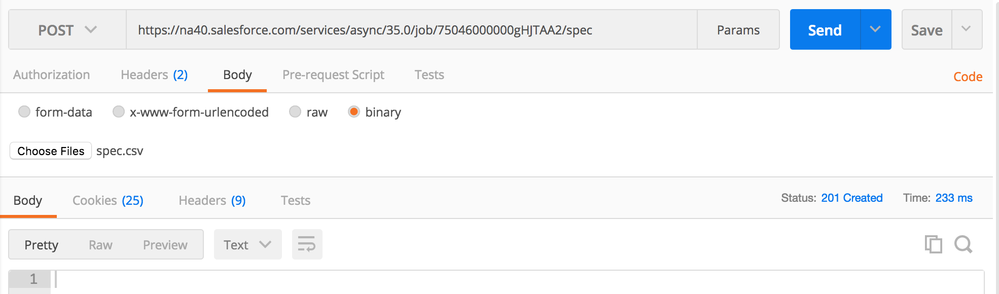
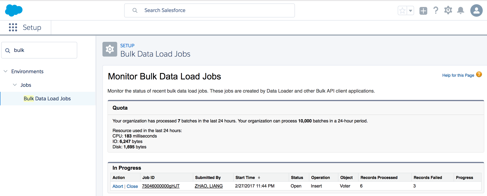

# BULK

* Dataloader was actually using Bulk APIs to do the mass data operation, so the workflow is identical:
  * create job (choose sObject and operation)
  * add batch to the job
  * close job
  * check job status
  * retrieve results

* Login
  * request

```
POST /services/oauth2/token HTTP/1.1
Host: login.salesforce.com
Cache-Control: no-cache
Postman-Token: f058380b-6b26-558d-5249-744cb72803d0
Content-Type: multipart/form-data; boundary=----WebKitFormBoundary7MA4YWxkTrZu0gW

------WebKitFormBoundary7MA4YWxkTrZu0gW
Content-Disposition: form-data; name="grant_type"

password
------WebKitFormBoundary7MA4YWxkTrZu0gW
Content-Disposition: form-data; name="client_id"

3MVG9i1HRpGLXp.roKZAn6RrY.yzJ9j5G0MUNy_2PomD1qKJB0IzH0SpKYe9hfkQs00w3YZoPuULK8Uzut1oU
------WebKitFormBoundary7MA4YWxkTrZu0gW
Content-Disposition: form-data; name="client_secret"

6593741349799758145
------WebKitFormBoundary7MA4YWxkTrZu0gW
Content-Disposition: form-data; name="username"

liang.zhao.sfdc.integration.apis@jz.com
------WebKitFormBoundary7MA4YWxkTrZu0gW
Content-Disposition: form-data; name="password"

ba76acaHhtf5m1SYhiN0vQ6g1qYkWEGgo
------WebKitFormBoundary7MA4YWxkTrZu0gW--
```

  * response
```
{
  "access_token": "00D46000000YxRg!ARIAQBxxHQ2Ctzu_LZ2qYC9Hqhw6B4H4v1i335xHUItpQvVfB2B1OrL.9Jx0MHmvTagaziZwFU7wu2lO7e9hBnHITNEAikWJ",
  "instance_url": "https://na40.salesforce.com",
  "id": "https://login.salesforce.com/id/00D46000000YxRgEAK/00546000000piQWAAY",
  "token_type": "Bearer",
  "issued_at": "1488265527524",
  "signature": "dLAi7FylfhJr3nwXU4KxMJfE1J7U+vNbQllgEO26M/A="
}
```

* DEMO 1 (insert Voter__c records)

  * Create Job
    * request (we set contentType to XML, so later when we attach batch to job, the contentType should be `application/xml` as well)
    ```
    POST /services/async/35.0/job HTTP/1.1
    Host: na40.salesforce.com
    Content-Type: application/xml
    X-SFDC-Session: 00D46000000YxRg!ARIAQBxxHQ2Ctzu_LZ2qYC9Hqhw6B4H4v1i335xHUItpQvVfB2B1OrL.9Jx0MHmvTagaziZwFU7wu2lO7e9hBnHITNEAikWJ
    Cache-Control: no-cache
    Postman-Token: 7cbbffec-0423-d268-35c0-ad8fdf56668c

    <?xml version="1.0" encoding="UTF-8"?>
    <jobInfo xmlns="http://www.force.com/2009/06/asyncapi/dataload">
    <operation>insert</operation>
    <object>Voter__c</object>
    <contentType>XML</contentType>
    </jobInfo>
    ```

    * response
    ```
    <?xml version="1.0" encoding="UTF-8"?>
    <jobInfo
       xmlns="http://www.force.com/2009/06/asyncapi/dataload">
        <id>75046000000gHJOAA2</id>
        <operation>insert</operation>
        <object>Voter__c</object>
        <createdById>00546000000piQWAAY</createdById>
        <createdDate>2017-02-28T07:28:53.000Z</createdDate>
        <systemModstamp>2017-02-28T07:28:53.000Z</systemModstamp>
        <state>Open</state>
        <concurrencyMode>Parallel</concurrencyMode>
        <contentType>XML</contentType>
        <numberBatchesQueued>0</numberBatchesQueued>
        <numberBatchesInProgress>0</numberBatchesInProgress>
        <numberBatchesCompleted>0</numberBatchesCompleted>
        <numberBatchesFailed>0</numberBatchesFailed>
        <numberBatchesTotal>0</numberBatchesTotal>
        <numberRecordsProcessed>0</numberRecordsProcessed>
        <numberRetries>0</numberRetries>
        <apiVersion>35.0</apiVersion>
        <numberRecordsFailed>0</numberRecordsFailed>
        <totalProcessingTime>0</totalProcessingTime>
        <apiActiveProcessingTime>0</apiActiveProcessingTime>
        <apexProcessingTime>0</apexProcessingTime>
    </jobInfo>
    ```

  * Add batch to the job
    * request (`Content-Type`:`application/xml`,and attach `batch.xml` file - found under `mod4`)
    
    

  * Check job status
    

  * Close job
    
    

* DEMO 2 (Creating and Applying Transformation Specs - just like in Dataloader, there is a step to map csv fields aganist SFDC fields)
  * first create a job (set contentType to CSV this time)
  

  * create a spec
  
  

  * attach a batch to the job (with non-standard csv)
  
  

  * check the job status(and close the job from UI)
  

* DEMO 3 (Bulk Queries)
  * create query job
  
  

  * attach batch to the job
  
  

  * check the batch result
  

  * get the raw data of the result
  
