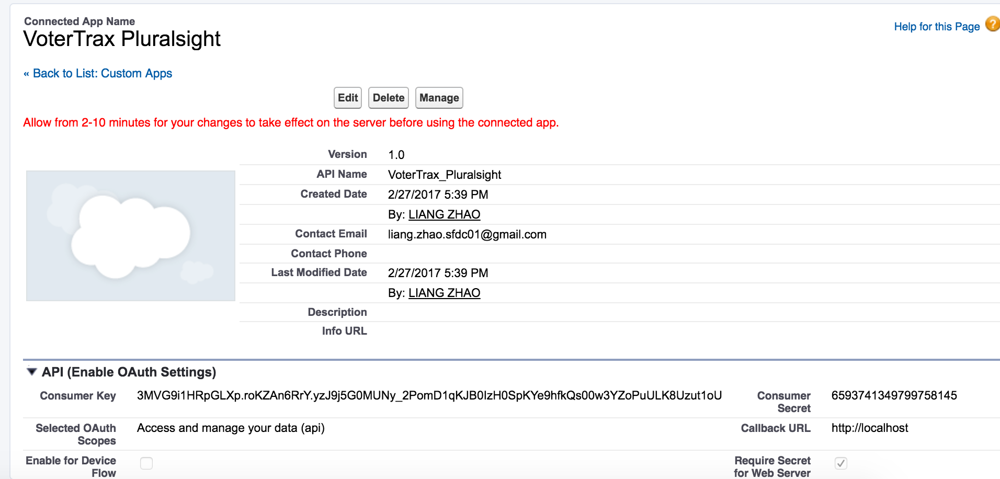
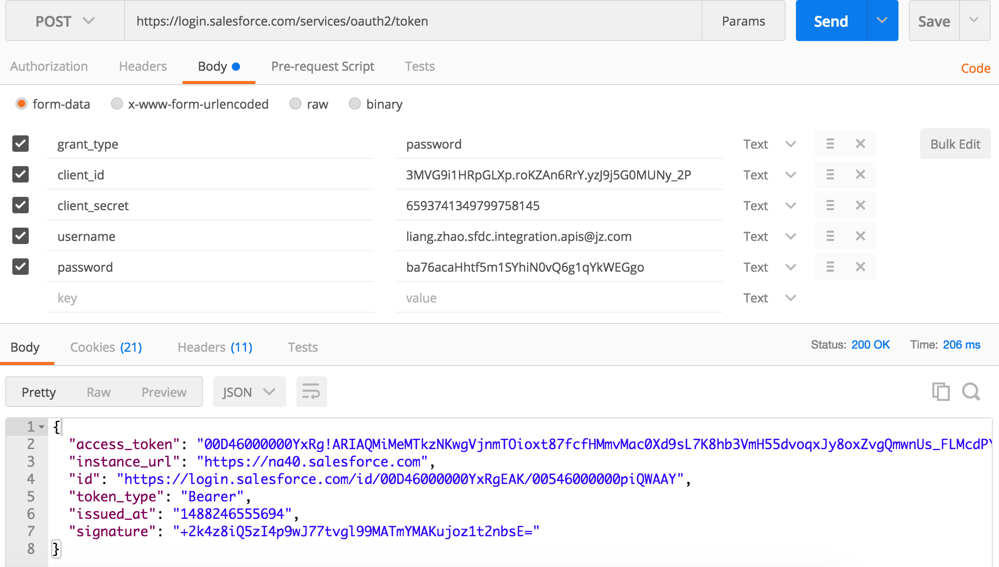

# RESTful

* Several major differences between RESTful and SOAP
  * JSON vs XML
  * RESTful has concept of resource, so the URL now has meaning
  * HTTP Verbs now have meaning for RESTful APIs (they have no meanings for SOAP APIs)

* Created a connected app in sfdc

* Login (Oauth type:password)

